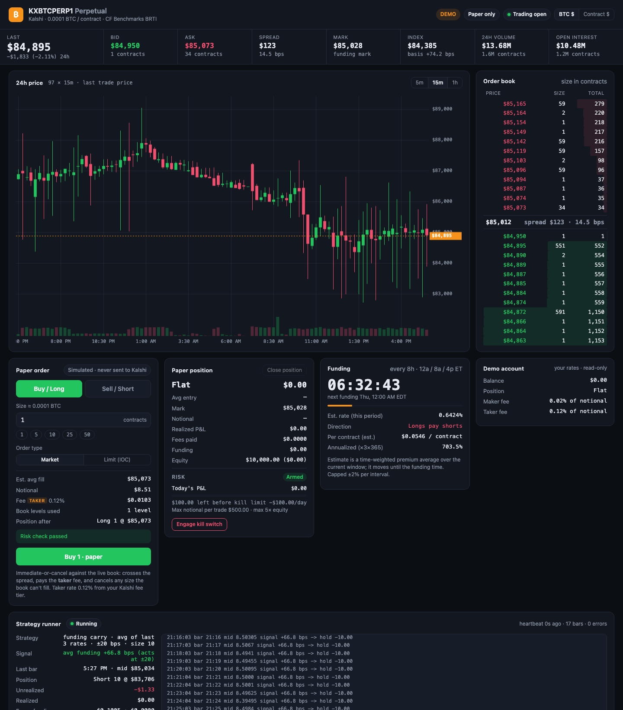
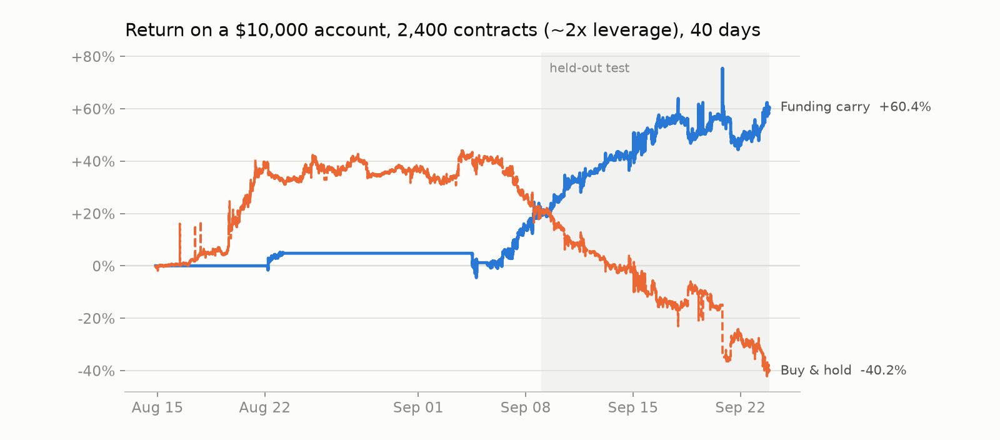
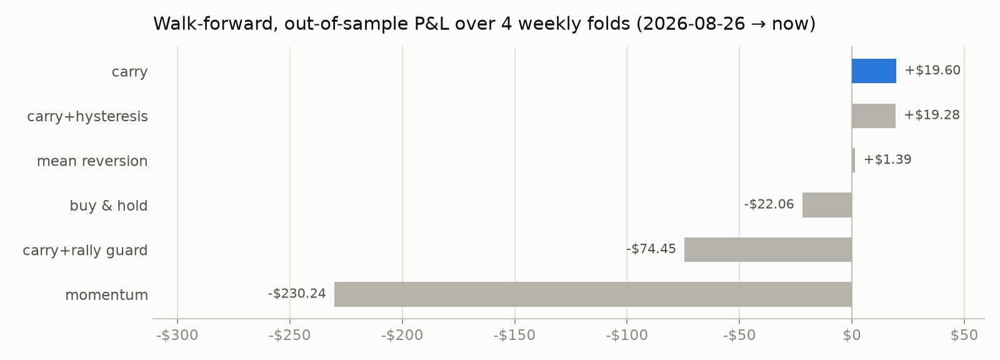
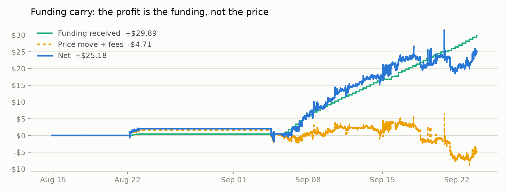
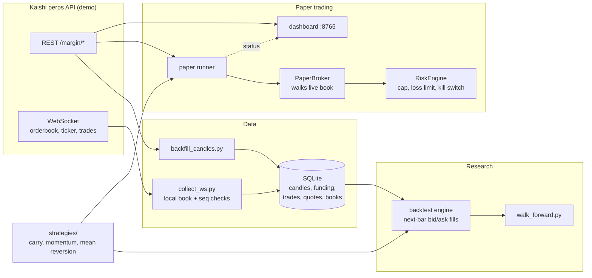

# kalshi-perps

[](https://github.com/AnanmayS/kalshi-perps/actions/workflows/tests.yml)

A Python trading system for Kalshi's **Bitcoin perpetual futures**: a signed REST and WebSocket client, a market-data pipeline, a backtester that refuses to invent fills, a risk engine with a kill switch, a live paper-trading runner, and a local dashboard. It is demo-first and paper-only by default.



## Highlights

- **Exchange connectivity from the spec.** RSA-PSS (and Ed25519) request signing, a REST client for Kalshi's `/margin/*` perps API, and an authenticated WebSocket collector that rebuilds the order book from snapshot + deltas, detects sequence gaps and resubscribes.
- **A backtester built to not flatter strategies.** Orders fill at the *next* minute's observed bid/ask (never the mid, never the signal bar), don't fill when that side of the book was empty, and always pay the taker fee with Kalshi's documented rounding. Funding is settled on whatever position is held at each funding time.
- **Out-of-sample research.** Strategies are compared by walk-forward testing: parameters are chosen only from data before each week, then scored on that week.
- **The same code path from backtest to paper trading.** The live runner builds the same bars, runs the same strategy objects, and uses the same fee, position and risk code as the backtester, with a slippage guard for thin books.
- **Safety by construction.** Real orders need `KALSHI_ENV=prod` **and** `KALSHI_LIVE_TRADING` set to exactly `"true"`; anything else raises before a request is built. A risk engine enforces a per-trade notional cap and a daily loss limit that trips a kill switch.
- **96 offline tests** (no keys, no network) covering signing, P&L sign on shorts, entry price on position flips, fee rounding, funding direction, lookahead, sequence gaps and the kill switch. They run in CI on every push.

## Results

**Funding carry returned +60.4% on a $10,000 account over 40 days at ~2× leverage (max drawdown −17.7%), and +39.6% on the held-out final two weeks alone. Buy-and-hold at the same size lost 40.2%.** That's the configuration the live paper runner trades.



The research below was done at a small fixed size (10 contracts) so strategies are compared on the same footing; returns scale roughly linearly with size, and so do drawdowns. All tests use Kalshi's demo market (`KXBTCPERP1`), Aug 14 – Sep 23 2026: 55,210 one-minute bars, 0.12% taker fee.



| Strategy | Out-of-sample (4 weeks, walk-forward) | Why |
| --- | --- | --- |
| **Funding carry** | **+$19.60** | Demo funding averaged 0.31% per 8h (recently ~0.66%), mostly paid by longs to shorts. Short while recent funding is high and collect it. |
| Mean reversion | +$1.39 | Fading stretched moves is profitable *before* costs, but the edge is about the size of the taker fees. |
| Buy & hold | −$22.06 | Pays that same funding. |
| Momentum | −$230.24 | Demo BTC mean-reverts on minute-to-hour horizons, so trend following buys tops. |



Over the full 40 days carry made **+$25.18** from 5 fills: +$29.89 of funding against a −$4.71 price and fee loss. The honest caveats: demo funding is far above typical production levels, most of the profit comes from a single short held for about 18 days, and 40 days is a short sample. **[Full write-up: docs/RESULTS.md](docs/RESULTS.md)**

## Architecture



## Quickstart

```bash
git clone https://github.com/AnanmayS/kalshi-perps.git && cd kalshi-perps
python3 -m venv .venv && source .venv/bin/activate
pip install -r requirements.txt
cp .env.example .env            # git-ignored; confirm with: git check-ignore .env
```

Create demo API keys at <https://demo.kalshi.co> → **Account & security → API Keys → Create Key → RSA**. Save the PEM to `~/.kalshi/demo-key.pem` (`chmod 600`) and put the key ID in `.env`. Market data works without keys; the WebSocket and account endpoints need them.

```bash
python scripts/market_check.py                   # connectivity + auth check (never places orders)
python dashboard/server.py                       # http://localhost:8765
python scripts/backfill_candles.py --days 40     # 1m candles + funding -> data/market.sqlite
python scripts/collect_ws.py                     # live trades / quotes / book snapshots
python -m backtest.run --strategy carry          # single backtest with P&L attribution
python scripts/walk_forward.py                   # out-of-sample comparison of all strategies
python scripts/paper_run.py --strategy carry     # trade a strategy live, on paper
pytest                                           # offline test suite
```

To run it 24/7 on a free Oracle Cloud server, see **[docs/DEPLOY.md](docs/DEPLOY.md)**.

To regenerate the charts: `pip install -r requirements-dev.txt && python scripts/walk_forward.py --json data/wf.json && python scripts/make_report.py`.

## How it works

**Signing.** Each request signs `timestamp_ms + METHOD + path` (path from the API root, query string stripped) with RSA-PSS/SHA-256, salt length equal to the digest. The WebSocket handshake is signed the same way over `/trade-api/ws/v2/margin`.

**Order book.** The collector applies signed size deltas to a snapshot. A skipped `seq` marks the book invalid (nothing is recorded from it) and requests a fresh snapshot. Checked against the REST book: identical top 10 levels and full depth (2,397 bid levels on both).

**Backtester** (`backtest/engine.py`). Event loop per minute: settle funding due before the bar opens → execute the previous bar's decision at this bar's opening bid/ask → settle funding inside the bar → mark to market and update the risk engine → ask the strategy for a target position. Strategies see funding rates only after each payment.

**Paper broker** (`kalshi_perps/paper.py`). Immediate-or-cancel orders sweep the live book level by level. Size the book can't fill is cancelled, never assumed. Every fill is labelled TAKER and charged `ceil_6dp(rate × notional)`, with balances rounded to $0.0001 as Kalshi documents.

**Position accounting** (`kalshi_perps/accounting.py`). Signed quantity; unrealized P&L is `qty × (mark − entry)`, so a short gains when price falls. A fill that flips the position realizes P&L on the closed part and starts the new side at the fill price, not a blend of the two.

**Risk engine** (`risk/engine.py`). Default $500 max notional per trade and $100 daily loss limit (UTC day, marked to market, including fees and funding). When the kill switch trips, only reducing orders are allowed and the runner flattens the position. The backtester applies the same rule.

**Paper runner** (`runner/paper.py`). Replays recent candles to warm up the strategy without trading on them. Missed bars (laptop asleep) update the strategy but never trade. Fills are limited to 25 bps from the mark: the demo book sometimes empties for a moment right after the minute, so the runner retries instead of taking a bad price.

## Project layout

| Path | What |
| --- | --- |
| `kalshi_perps/` | Config, signing, REST client, WebSocket collector, SQLite store, position accounting, paper broker |
| `risk/` | Risk engine: notional cap, daily loss limit, kill switch |
| `backtest/` | Data loading, event-driven engine, CLI, parameter sweeps and walk-forward |
| `strategies/` | Strategy interface; funding carry, momentum, mean reversion, buy & hold |
| `runner/` | Live paper-trading runner |
| `dashboard/` | Local web dashboard (stdlib server + vanilla JS, canvas chart) |
| `scripts/` | Market check, backfill, collector, paper runner, walk-forward, report |
| `tests/` | pytest suite (offline) |

## Kalshi API notes (learned the hard way)

- Prices are dollars **per contract** (0.0001 BTC), so BTC price ≈ contract price × 10,000.
- `GET /margin/markets/{ticker}/orderbook` doesn't reliably return levels best-first; the client sorts them.
- Candles for minutes with an empty book carry sentinels (ask high = int64 max, bid low = 0); these are stored as NULL. Some minutes have no candle at all (~6% on demo).
- Candlestick requests are capped at 5,000 candles.
- Positive funding: longs pay shorts, clamped to ±2% per 8h. New keys default to Ed25519; both key types are supported.
- `/margin/balance` can return 403 on demo; the client reports "unavailable" instead of crashing.

## Disclaimer

A personal engineering project, not investment advice. It trades on paper against Kalshi's demo environment. Nothing here has been validated for real-money trading.
