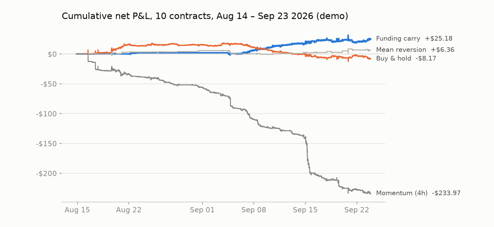

# Strategy research: BTC perpetuals on Kalshi (demo)

**Question.** Is there a simple, systematic strategy on Kalshi's BTC perpetual that makes money after realistic costs?

**Short answer.** One: a funding-carry strategy that shorts while demo funding is high. It made money out-of-sample in 3 of 4 weekly folds (the 4th was flat). Momentum and mean reversion don't survive taker fees. The carry result depends on demo funding levels that are much higher than production's, so it is a finding about this market, not a general edge.

## Data

| | |
| --- | --- |
| Market | `KXBTCPERP1` (Kalshi demo), 1 contract = 0.0001 BTC |
| Period | 2026-08-14 → 2026-09-23 (40 days) |
| Bars | 55,210 one-minute candles with trade OHLC **and** bid/ask OHLC; ~6% of minutes have no candle |
| Funding | 120 realized funding events (every 8h): mean 0.31%, median 0.16%, range −0.32% to +1.39%; 81 positive (longs pay) |
| Source | `scripts/backfill_candles.py` (public REST, chunked under the 5,000-candle cap) |

## Execution model

The backtester (`backtest/engine.py`) is deliberately pessimistic:

- A strategy sees a bar only after it closes and returns a target position.
- The order fills at the **next** bar's opening quote: buys at `ask_open`, sells at `bid_open`. It never fills at the mid or the signal bar's close.
- If that side of the book was empty, there is no fill.
- Every fill pays the **taker** fee (0.12%, the account's real tier), rounded up to $0.000001; balances round to $0.0001.
- Funding is settled on the position held at each funding time, at the event's mark price. Strategies learn a funding rate only after it's paid.
- The same risk engine as live paper trading applies ($500 max notional per trade, $100 daily loss limit with kill switch).
- Not modelled: order-book depth (candles don't have it) and liquidation. Sizes are kept at 10 contracts (~$85), far inside the displayed depth.

Tests cover each of these (`tests/test_backtest.py`), including an explicit lookahead test.

## Method

1. **Development split.** Tune on Aug 14 – Sep 9 only; Sep 9 – 23 held back and scored once for the chosen candidate.
2. **Walk-forward** (`scripts/walk_forward.py`). For each weekly fold from Aug 26, choose each family's parameters using only data before the fold (expanding window), then score the fold. The fold totals are fully out-of-sample and measure the whole selection process, not one lucky parameter set.

## Results

### Walk-forward (out-of-sample)


| Family | Aug 26 | Sep 2 | Sep 9 | Sep 16 | **Total** | Fills |
| --- | ---: | ---: | ---: | ---: | ---: | ---: |
| **Funding carry** | $0.00 | +$6.57 | +$9.90 | +$3.13 | **+$19.60** | 7 |
| Carry + hysteresis | −$0.81 | +$7.33 | +$9.63 | +$3.13 | +$19.28 | 11 |
| Mean reversion | +$1.45 | −$6.24 | +$2.47 | +$3.71 | +$1.39 | 74 |
| Buy & hold | +$0.53 | −$5.57 | −$13.03 | −$4.00 | −$22.06 | 4 |
| Carry + rally guard | $0.00 | −$14.80 | −$44.06 | −$15.59 | −$74.45 | 195 |
| Momentum | −$18.40 | −$58.81 | −$91.84 | −$61.19 | −$230.24 | 356 |

### Held-out split (Sep 9 – 23)

The carry parameters (average of last 3 rates, 20 bps threshold) were fixed on the development period, then run once on the held-back two weeks: **+$16.49** (funding +$22.33, price −$5.75, 1 fill). Buy-and-hold lost $16.78 over the same weeks. All 9 neighbouring parameter sets were also positive on the held-out data (+$13.39 to +$16.49).

### Full period



| Strategy | Net | Fills | Max drawdown |
| --- | ---: | ---: | ---: |
| Funding carry | **+$25.18** | 5 | −$12.97 |
| Mean reversion (strict) | +$6.36 | 104 | −$7.86 |
| Buy & hold | −$8.17 | 1 | −$33.19 |
| Momentum (4h) | −$233.97 | 386 | −$234.98 |


## What the numbers say

**Momentum loses because the market mean-reverts.** Every momentum variant lost, in every week, before and after costs. The fast version (15 min / 30 bps) lost $1,126 over 40 days on 2,922 fills.

**Mean reversion has an edge that fees eat.** On the development period, 51 of 180 strict variants were profitable before costs. None were after them: the average gain per trade was roughly the 0.24% round-trip taker cost. A maker (limit-order) version might work, but it can't be simulated honestly from candles, because queue position is unknown.

**Carry works because demo funding is extreme.** It averaged 0.31% per 8h over the period (about 340% a year) and ran near 0.66% in the last weeks, mostly paid by longs. Shorting while the recent average is above 20 bps collected +$29.89 of funding over 40 days against −$4.71 of price moves and fees. Adding a rally guard (step aside when BTC rises sharply) made it much worse: it paid spread and fees stepping in and out and missed the funding.

**One sanity check that paid off.** Mean reversion showed +$6.84 on the held-out weeks after losing in all 228 development variants. That's what a result that doesn't carry forward looks like; selecting on the held-out period would have picked it.

## Limitations

- **Sample size.** 40 days, and most of carry's profit is one short held from Sep 5. Four folds is thin evidence.
- **Demo market.** Demo funding and liquidity aren't production's. Production funding is usually a small fraction of this, so the carry edge may not exist there.
- **Directional risk.** Carry is net short BTC with no hedge. A strong rally would swamp the funding income.
- **Depth and liquidation** aren't in the backtest; the live paper runner does walk the full book and has a slippage guard.
- **Small size.** Results are for 10 contracts (~$85 notional); P&L scales roughly linearly with size, and so do drawdowns.

## Reproduce

```bash
python scripts/backfill_candles.py --days 40
python scripts/walk_forward.py --json data/wf.json
python -m backtest.run --strategy carry --start 2026-09-09
pip install -r requirements-dev.txt && python scripts/make_report.py
```
